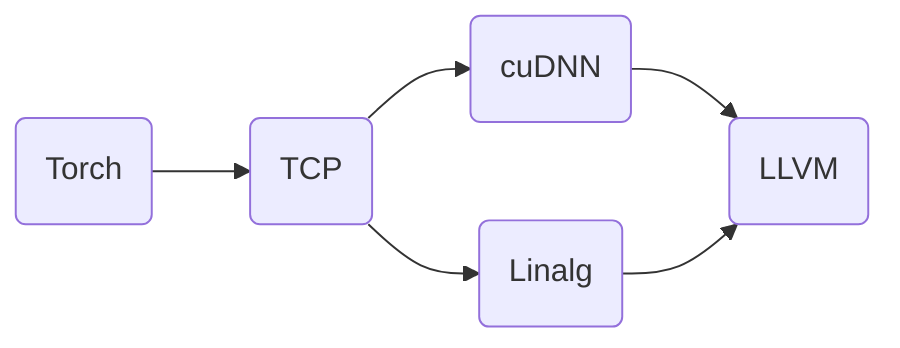

# MLIR ByteCode (standalone) reader

This is a standalone, pure C, event-driven parser for MLIR bytecode.

Basically the example Builder would replace BytecodeReader.cpp and Printer one is just a standalone example.
For dialect attributes & types, I'm still unsure the amount of hooks needed for in place parsing in general is really high to the point where just generating them seems better.

This project is under active development/being bootstrapped. It is being
developed as a part of MLIR project and post iteration out of tree it
will be moved to LLVM repo per normal upstream processes.

### Design decisions

1. Standalone reader with no dependencies

   Reason: Bytecode format is a spec as well as an implementation. Having
   multiple readers makes this both clearer as well as enables using the
   bytecode in places where one doesn't need/want to depend on MLIR as a whole

2. In-memory representation is configurable/no dedicated in memory format

   Reason: This parser is similar to event-based/SAX style parsing in that we
   have reader that triggers configurable events rather than building
   a single in-memory structure/DOM first. When looking around at different
   different uses we found that in use case we wanted to use bytecode format
   instead, the existing format's reader's in-memory structure was immediately
   getting reconverted into a more suitable form and not really used (e.g., it
   added overhead rather than utility). Instead, allow folks to read and construct
   (if desirable[^1]) their own in-memory structure. MLIR already has an in-memory
   structure but it need not be used/is an example of reader implementation.

3. Include C library

   Reason: All hooks are expected to be implemented to result in a complete
   library. This library doesn't really expose an API as much as provides
   scaffolding for bytecode parsing (e.g., this is like the code generated by
   yacc vs user API that's wrapped around it).

4. Allow partial parsing/early aborts

   Reason: Applications where one needs more "raw" interactions with the IR
   (e.g., disable general structure, mutate a legacy .mlirbc file that can no
   longer be read by default MLIR reader), or where the consumer of the file has
   limit capability (e.g., abort if op without registered lowering is in input).

[^1]: It is very rarely not convenient to at least cache lookup table into file
as the alternative requires iterating over sections again.

#### Additional considerations

1. Keep allocations inside parser to minimal/let instantiation dictate allocating.

   Note: Some allocations can only be avoided by doing additional work or by
   restricting the spectrum of MLIR files that can be consumed.

### Compilation

Build and testing with:

```sh
cmake -B build && cmake --build build && ./build/examples/Printer/MlirBytecodePrintParse testdata/general.mlirbc
```

Note: building for size constrained one probably wants to set MinSizeRel at
least, enable LTO and disable verbose error reporting and debugging. The optimal
compiler settings have not been explored.

To enable building tools & examples with MLIR dependencies set

`-DMLIR_DIR=$PREFIX/lib/cmake/mlir`

where

* `$PREFIX` is the install directory for MLIR;

```mermaid
graph TD;
  Torch --> TCP --> cuDNN / Linalg --> LLVM
```

```mermaid
graph TD;
  Torch --> TCP;
  TCP --> cuDNN / Linalg;
  cuDNN / Linalg --> LLVM
```

```mermaid
flowchart LR;
  Torch --> TCP;
  TCP --> cuDNN / Linalg;
  cuDNN / Linalg --> LLVM
```



### Structure

- `Parse.h` is the bytecode parsers (see its header for how to instantiate implementation);
- `{Dialect}Parse.h` are the `Dialect`'s attribute & type parsers;
- `examples/Printer/PrintParse.c` is an example instantiation that simply prints out the IR;
- tblgen/
  Helpers to bootstrap dialect parser specification.

### TODO

- [x] Bytecode structure callbacks for parsing all sections
- [ ] Complete Builtin dialect parsing methods
- [ ] Unit tests
- [ ] C++ example
- [ ] Switch to passing struct of callbacks for parsing in similar parsing methods
- [ ] Fuzzer
- [ ] Ensure unhandled is properly handled
- [ ] Reduce duplication with C++ side


